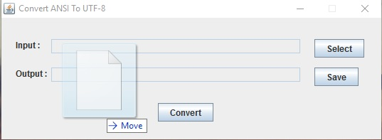
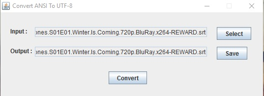

# Convert To UTF-8
This project fixes the UTF errors of any type of broken text files.
For example:
```
Hatýrlýyor musun?
Zeki oðlum benim.
```
After fixed:
```
Hatırlıyor musun?
Zeki oğlum benim.
```

It is useful for fixing broken subtitle files.

Select or drag and drop the file and just click the convert button.




This is [the runnable jar](ConvertToUTF.jar) file. 
